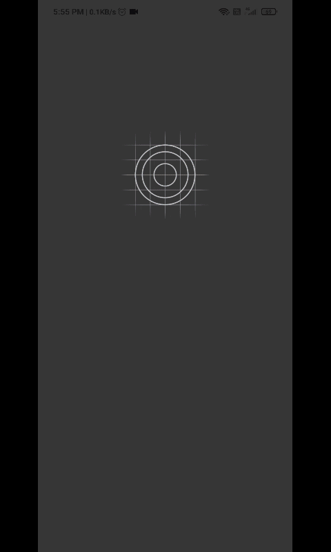
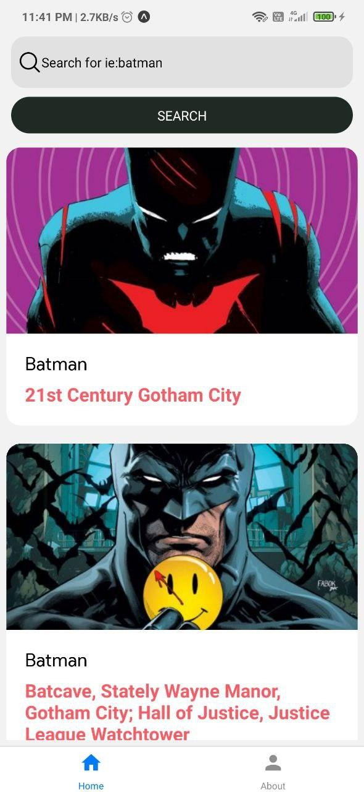
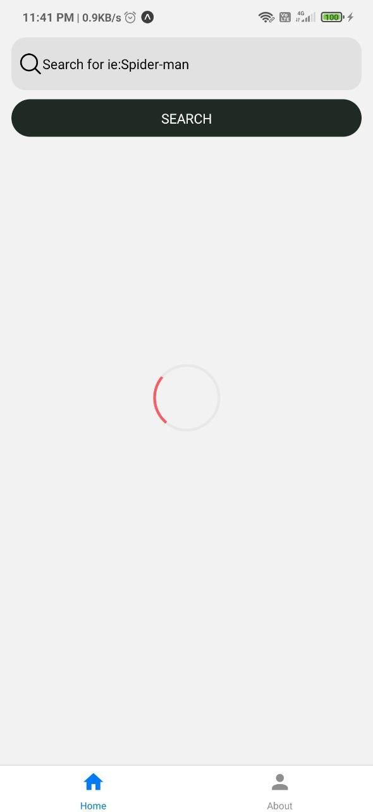
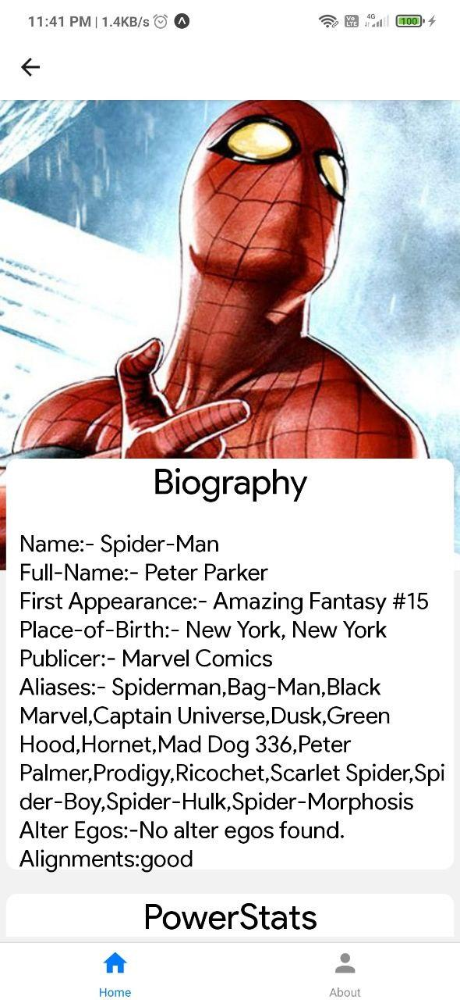
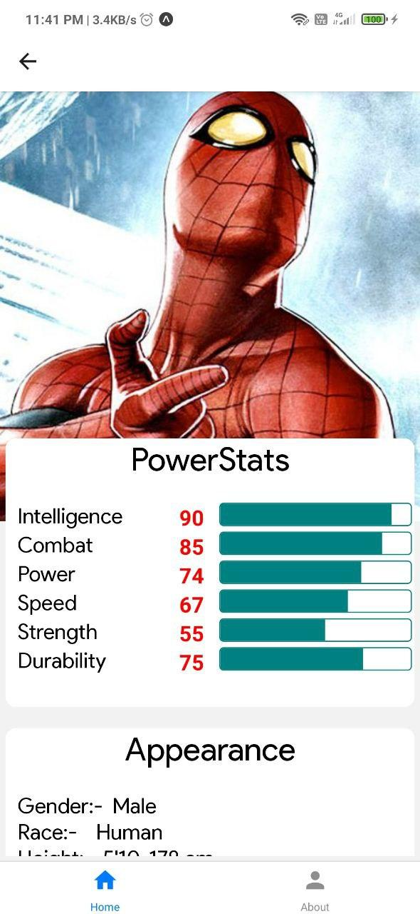
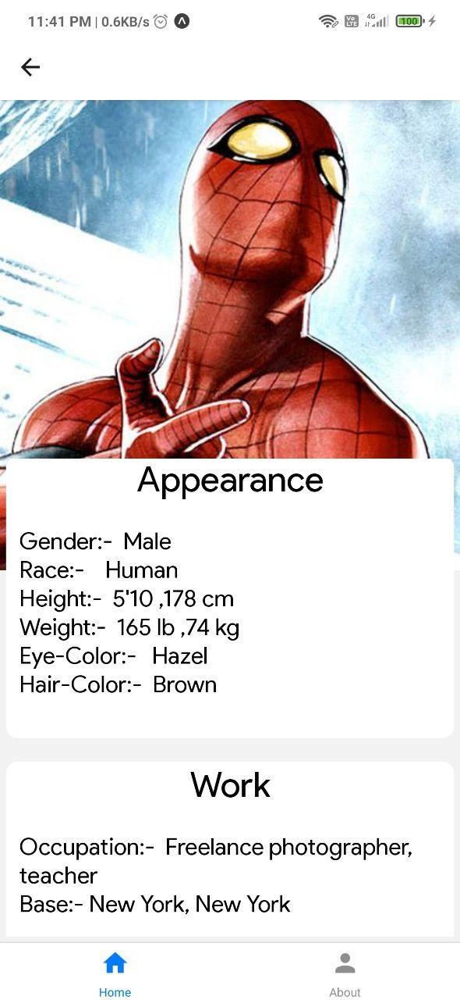
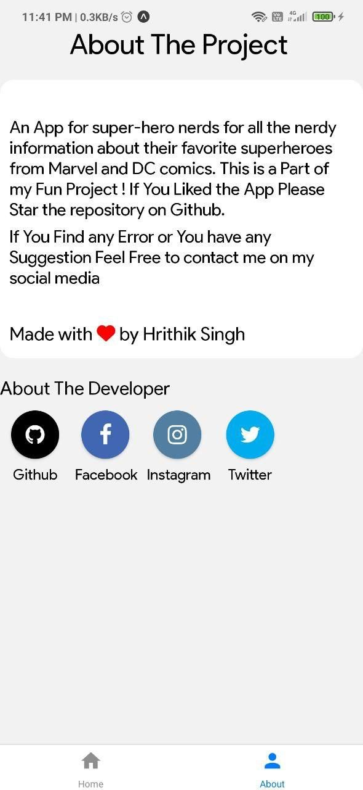

# super-heros
 :pencil:
An App for super-hero nerds for all the nerdy information about their favorite superheroes from Marvel and DC comics.

## :arrow_right:  Demo
<!-- 
 -->
<!--  </p-->

  
### screenshots:-  
|                                                          |                                                          |                                                          |
| -------------------------------------------------------- | -------------------------------------------------------- | -------------------------------------------------------- |
|  |  |  |

|                                                          |                                                          |                                                          |
| -------------------------------------------------------- | -------------------------------------------------------- | -------------------------------------------------------- |
|  |  |  |

## Installation

1. Clone the Repository
  
   <pre><code>git clone https://github.com/hrithik73/super-heros.git</code></pre>

2. Next, run the next command to install all project dependencies:
   For Yarn: <pre><code>yarn install</code></pre>
   For npm: <pre><code>npm install</code></pre>

## How to run the app
1. Get into the folder of the project by running the next command:

   <pre><code>cd super-nerds</code></pre>

2. Start your expo-server by running the next command:

    <pre><code>expo start</code></pre> 
   OR you can also use npm <pre><code>npm start</code></pre>

3. After server get started open open your expo client App on android or ios and scan the QR code to run the app

## Tools Used 
### expo-cli
 - This project uses expo-cli to build the react-native apps
### API 
- A special mention and thanks to this awesome api which is the heart of this application
[https://superheroapi.com/](https://superheroapi.com)

## Author
- Github: [Hrithik Singh](https://github.com/hrithik73)
- Twitter: [@_hrithiksingh](https://www.twitter.com/_hrithiksingh)
- Linkedin: [Hrithik Singh](https://www.linkedin.com/in/hrithik-singh-a8547b198/)

## Contributing
Pull requests are welcome. Please feel free to make a contribution, report any issue, feature request or provide any feedback.
